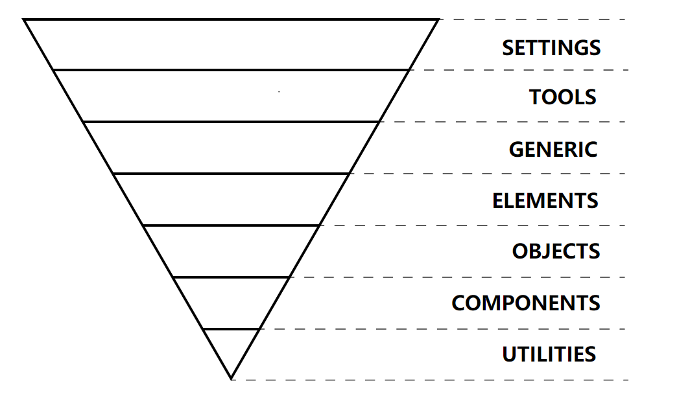
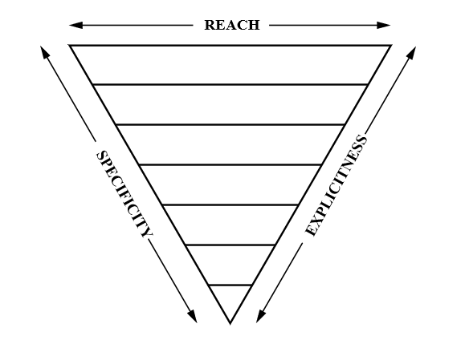

# [MaintainableCSS](https://maintainablecss.com/)

1.  原子类几乎只有比行内样式少写几个字符这一个优点，缺点倒是一堆，最好别用
2.  一味追求 “永远不要重复同样的事情两次” 会导致过度思考和过度设计，最终出现原子类
3.  用 ID 设置样式不好，ID 应该用在表单字段、hash、ARIA 等特殊用途上
4.  使用`.<module>[-<component>][-<state>] {}`这种体现模块和组件的命名方式
5.  创建可复用的模块
6.  修改器用于在覆盖样式时使用，用来为元素的不同状态设置样式
7.  全局 CSS 放在单独的文件及，因为它不属于任何模块
8.  最终加载的 CSS 要限制在 31 个，因为多出来的 CSS 文件 IE9 会忽略掉，并且少的 CSS 文件可以减少网络请求

# [Code Guide by @mdo](https://codeguide.co/)

CSS 属性声明顺序：

-   首先是位置因为它跟文档流相关，并且可以覆盖盒模型的样式
-   其次是盒模型，声明组件的尺寸和放置
-   最后是组价内部的，不会影响位置和盒模型的样式

```css
.declaration-order {
  /* Positioning */
  position: absolute;
  top: 0;
  right: 0;
  bottom: 0;
  left: 0;
  z-index: 100;

  /* Box-model */
  display: block;
  float: right;
  width: 100px;
  height: 100px;

  /* Typography */
  font: normal 13px "Helvetica Neue", sans-serif;
  line-height: 1.5;
  color: #333;
  text-align: center;

  /* Visual */
  background-color: #f5f5f5;
  border: 1px solid #e5e5e5;
  border-radius: 3px;

  /* Misc */
  opacity: 1;
}
```

# [jareware/css-architecture](https://github.com/jareware/css-architecture#5-prevent-leaking-styles-outside-the-component)

1.  用 class 不要用 ID 和元素选择器。
2.  组件和样式放在同一文件夹（好找）。
3.  一致的 class 命名`app-Component-class`。
4.  命名空间和文件名对应。
5.  防止组件内样式向外泄露：class 加上命名空间防止组件内样式泄露到外面。
6.  防止组件内样式向内泄露：用 class 不要使用元素选择器，如果想用元素选择器要加上 `>` 限定。
7.  防止外部样式进入组件：用权重比外部样式高的样式重置所有元素的样式（会导致有用的外部样式也被重置），`all: initial`，Shadow DOM，`<iframe>`。
8.  尊重组件的边界，不要修改组件 “内” 的样式。对于组件 “内” 的可继承样式，可以设置在父元素让组件继承。
9.  松散地集成外部样式：让自己的 class 继承外部样式，不要给元素设置外部样式的 class 使用样式。

# [rscss](https://rscss.io/index.html)

## 组件

最少两个字符，用`-`分隔。

-   A like button (`.like-button`)
-   A search form (`.search-form`)
-   A news article card (`.article-card`)
-   A namespaced component (`.rico-custom-header`)

有的组件可以用一个单词就表示，这时可以加后缀使它更清晰。

block-level element:

-   `.alert-box`
-   `.alert-card`
-   `.alert-block`

Or for inlines:

-   `.link-button`
-   `.link-span`

## 元素

避免标签选择器。

尽量使用`>`子元素选择器，而不是后代选择器。

尽量一个单词，多个单词不要用横线和下划线链接，例如：

```scss
.profile-box {
  > h3    { /* ✗ avoid */ }
  .title     { /* okay */ }
  > .author  { /* ✓ better */ }

  > .firstname { /* ... */ }
  > .lastname { /* ... */ }
  > .avatar { /* ... */ }
}
```

## 变体

变体由横线开头。

```scss
.like-button {
  &.-wide { /* ... */ }
  &.-short { /* ... */ }
  &.-disabled { /* ... */ }
}
.shopping-card {
  > .title { /* ... */ }
  > .title.-small { /* ... */ }
}
```

横线开头的好处：

-   避免和元素弄混
-   CSS 类名只能是`-`和`_`开头
-   容易打
-   像 UNIX 命令的开关 (`gcc -O2 -Wall -emit-last`)

## 组件嵌套

不要进入组件修改样式，而是使用变体。

不要这样：

```scss
.article-header {
  > .vote-box > .up { /* ✗ avoid this */ }
}
```

要这样：

```html
<div class='article-header'>
  <div class='vote-box -highlight'>
    ...
  </div>
  ...
</div>
```

```scss
.vote-box {
  &.-highlight > .up { /* ... */ }
}
```

推荐使用继承进行简化。

不推荐：

```html
<div class='search-form'>
  <input class='input' type='text'>
  <button class='search-button -red -large'></button>
</div>
```

推荐：

```html
<div class='search-form'>
  <input class='input' type='text'>
  <button class='submit'></button>
</div>
```

```scss
.search-form {
  > .submit {
    @extend .search-button;
    @extend .search-button.-red;
    @extend .search-button.-large;
  }
}
```

## 布局

因为组件会用在各种上下文，因此要避免使用：

-   Positioning(`position`, `top`, `left`, `right`, `bottom`)
-   Floats(`float`, `clear`)
-   Margins(`margin`)
-   Dimensions(`width`, `height`) \*

上述 CSS 属性应该设置在父元素，例如：

```css
.article-list {
  & {
    @include clearfix;
  }

  > .article-card {
    width: 33.3%;
    float: left;
  }
}

.article-card {
  & { /* ... */ }
  > .image { /* ... */ }
  > .title { /* ... */ }
  > .category { /* ... */ }
}
```

## 辅助类

下划线开头，用来覆盖某些属性。不建议多用！

```css
._unmargin { margin: 0 !important; }
._center { text-align: center !important; }
._pull-left { float: left !important; }
._pull-right { float: right !important; }
```

## 文件结构

一个文件一个组件，可以 `@import 'components/*';` 这样引入全部组件的样式。

最多使用一层嵌套，这样可读性好。

```scss
/* ✗ Avoid: 3 levels of nesting */
.image-frame {
  > .description {
    /* ... */

    > .icon {
      /* ... */
    }
  }
}

/* ✓ Better: 2 levels */
.image-frame {
  > .description { /* ... */ }
  > .description > .icon { /* ... */ }
}
```

# RSCSS、BEM、SMACSS 名词对比

| RSCSS     | BEM      | SMACSS             |
| --------- | -------- | ------------------ |
| Component | Block    | Module             |
| Element   | Element  | Sub-Component      |
| Layout    | ?        | Layout             |
| Variant   | Modifier | Sub-Module & State |

# [ITCSS](https://www.xfive.co/blog/itcss-scalable-maintainable-css-architecture/)

ITCSS 代表**Inverted Triangle CSS**，它可以帮助您组织项目 CSS 文件，从而可以更好地**处理**（但并不总是易于处理）CSS 细节，例如**全局命名空间，层叠和选择器专一性**。

ITCSS 的主要原则之一是将 CSS 代码库分为几个部分（称为**层**），这些部分采用倒三角形的形式：



-   **设置（settings）** –与预处理器一起使用，并包含字体，颜色定义等。
-   **工具（tools）** –全局使用的 mixins 和 functions。不要在前 2 层中输出任何 CSS。
-   **通用（generic）** –重置（reset）或规范化（normalize）样式，盒大小定义等。这是生成实际 CSS 的第一层。
-   **元素（elements）** –裸 HTML 元素（例如 H1，A 等）的样式。这些带有浏览器的默认样式，因此我们可以在此处重新定义它们。
-   **对象（objects）** –定义未装饰设计模式的基于类的选择器，例如 OOCSS 的[媒体对象](https://github.com/stubbornella/oocss/wiki/Content#media-object-)。
-   **组件（components）** –特定的 UI 组件。这是我们主要工作的地方，我们的 UI 组件通常由对象和组件组成。
-   **工具类（utilities）** –工具类能够覆盖三角形中之前发生的任何规则，例如：隐藏工具类。

倒三角形还显示了选择器代表的样式在结果 CSS 中的排序方式：从通用样式到显式样式，从低特定选择器到高特定的选择器（也不是很特定，因为不允许使用 ID），以及从广泛到局部。



ITCSS 与[BEMIT 命名约定](http://csswizardry.com/2015/08/bemit-taking-the-bem-naming-convention-a-step-further/)结合使用，使您可以将更多精力放在解决前端挑战上，而不用考虑名称和样式的位置。这是`Xfive.co`的`main.scss`

```scss
@import "settings.colors";
@import "settings.global";

@import "tools.mixins";

@import "normalize-scss/normalize.scss";
@import "generic.reset";
@import "generic.box-sizing";
@import "generic.shared";

@import "elements.headings";
@import "elements.hr";
@import "elements.forms";
@import "elements.links";
@import "elements.lists";
@import "elements.page";
@import "elements.quotes";
@import "elements.tables";

@import "objects.animations";
@import "objects.drawer";
@import "objects.list-bare";
@import "objects.media";
@import "objects.layout";
@import "objects.overlays";

@import "components.404";
@import "components.about";
@import "components.archive";
@import "components.avatars";
@import "components.blog-post";
@import "components.buttons";
@import "components.callout";
@import "components.clients";
@import "components.comments";
@import "components.contact";
@import "components.cta";
@import "components.faq";
@import "components.features";
@import "components.footer";
@import "components.forms";
@import "components.header";
@import "components.headings";
@import "components.hero";
@import "components.jobs";
@import "components.legal-nav";
@import "components.main-cta";
@import "components.main-nav";
@import "components.newsletter";
@import "components.page-title";
@import "components.pagination";
@import "components.post-teaser";
@import "components.process";
@import "components.quote-banner";
@import "components.offices";
@import "components.sec-nav";
@import "components.services";
@import "components.share-buttons";
@import "components.social-media";
@import "components.team";
@import "components.testimonials";
@import "components.topbar";
@import "components.reasons";
@import "components.wordpress";
@import "components.work-list";
@import "components.work-detail";

@import "vendor.prism";

@import "trumps.clearfix";
@import "trumps.utilities";

@import "healthcheck";
```

# [OOCSS](https://github.com/stubbornella/oocss/wiki)

1.  结构与皮肤分开：着将重复的视觉特征（例如背景和边框样式）定义为单独的 “皮肤”。
2.  容器和内容分开：减少使用位置相关的样式，对象应该无论放在哪里都看起来一样。
