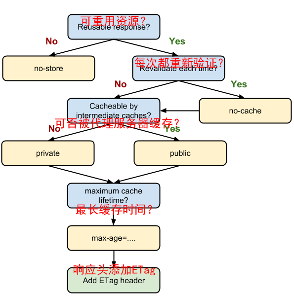

当发送 GET 请求时浏览器会检查该资源的缓存信息，并决定是否发送 HTTP 请求。如果需发送请求则根据响应决定是否使用原缓存，或不使用原缓存并设置新缓存。

# 浏览器处理 HTTP 缓存流程（简化版）

## 请求阶段

-   该资源是否有缓存？
    -   有缓存：
        -   该资源 `Cache-Control`或`Expires` 是否过期？
            -   未过期：直接使用缓存的资源。
            -   已过期：携带该资源的 `ETag` + `If-None-Match` 或 `Last-Modified` + `If-Modified-Since` 请求该资源。
    -   没有缓存：直接请求该资源。

## 响应阶段

1.  服务端返回 304 Not Modified 则未修改使用缓存的资源
2.  服务端返回 200 ok 则使用响应的资源，并根据响应头对改资源进行缓存

PS：在控制台查看缓存效果时注意关闭`禁用 HTTP 缓存`选项

# 缓存相关的响应头

一般来说优先级：Cache-Control > Expires > ETag > Last-Modified

## Cache-Control

规定资源有效期。

> Cache-Control 标头是在 HTTP/1.1 规范中定义的，取代了之前用来定义响应缓存策略的标头（例如 Expires）。所有现代浏览器都支持 Cache-Control，因此，使用它就够了。

## Expires

和 Cache-Control 类似，规定资源有效期。

## ETag

验证令牌，在资源过期后用来检查资源是否被修改。

Hash 算法：CRC32C 或 MD5

## Last-Modified

和 ETag 类似，在资源过期后用来检查资源是否被修改。

不过有些资源可能是定期生成的，最后修改时间变了但内容没变，这时使用 Last-Modified 就不合适了。

## Vary

通过验证请求头和缓存的响应头 Vary 指定的项是否匹配，决定是否使用缓存。

> 例如，使用 Vary: User-Agent 头，缓存服务器需要通过 UA 判断是否使用缓存的页面。如果需要区分移动端和桌面端的展示内容，利用这种方式就能避免在不同的终端展示错误的布局。

# 定义最佳的缓存机制

可以按照下图设置`Cache-Control`



# 可缓存的内容

> 缓存主要包括 request method 和目标 URI（一般只有 GET 请求才会被缓存）。
>
> 普遍的缓存案例:
>
> -   一个检索请求的成功响应：对于 GET 请求，响应状态码为：200，则表示为成功。一个包含例如 HTML 文档，图片，或者文件的响应。
> -   永久重定向：响应状态码：301。
> -   错误响应：响应状态码：404 的一个页面。
> -   不完全的响应：响应状态码 206，只返回局部的信息。
> -   除了 GET 请求外，如果匹配到作为一个已被定义的 cache 键名的响应。

# 前端实现禁用缓存

## 方法一：文件加上版本号 `/hash`

使用打包工具实现。

## 方法二：告诉浏览器不要缓存（不一定好使）

```
<meta http-equiv="Pragma" content="no-cache">
<meta http-equiv="Cache-Control" content="no-cache">
<meta http-equiv="Expires" content="-1">
```

## 方法三：请求 script 时加上随机字符串

```
<script>document.write('<script src="build/js/script.min.js?' + Math.rendom() + '">\x3C/script>')</script>
```

或者

```
var s = document.createElement('script');
s.setAttribute('src', '<script src="build/js/script.min.js?' + Math.rendom());
s.setAttribute('type', 'text/javascript');
document.getElementsByTagName('head')[0].appendChild(s);
```

# 参考

-   [【Web 缓存机制系列】2 – Web 浏览器的缓存机制 | AlloyTeam](http://www.alloyteam.com/2012/03/web-cache-2-browser-cache/#prettyPhoto)
-   [HTTP 缓存 | Web | Google Developers](https://developers.google.com/web/fundamentals/performance/optimizing-content-efficiency/http-caching)
-   [HTTP 缓存 - HTTP | MDN](https://developer.mozilla.org/zh-CN/docs/Web/HTTP/Caching_FAQ)
-   [Hashes and ETags: best practices  |  Cloud Storage  |  Google Cloud](https://cloud.google.com/storage/docs/hashes-etags)
