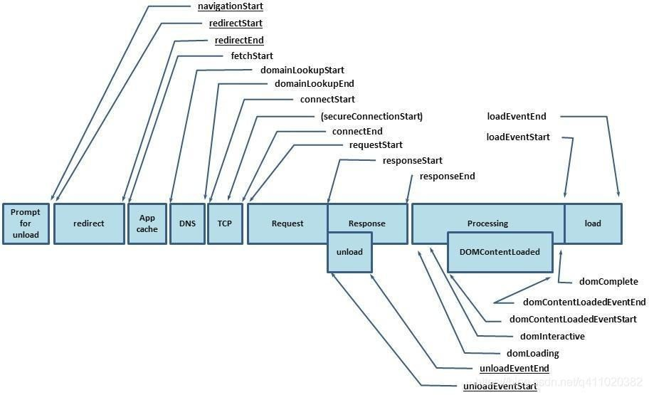

# RAIL model

RAIL stands for four distinct aspects of web app life cycle:

-   Response: process events in under 50ms
-   Animation: produce a frame in 10 ms
-   Idle: maximize idle time
-   Load: deliver content and become interactive in under 5 seconds

# [Navigation Timing API](https://developer.mozilla.org/en-US/docs/Web/API/Navigation_timing_API)

The Navigation Timing API provides data that can be used to measure the performance of a web site.

```
window.performance.timing
```



-   The load event is fired when the whole page has loaded, including all dependent resources such as stylesheets and images.
-   The DOMContentLoaded event fires when the initial HTML document has been completely loaded and parsed, without waiting for stylesheets, images, and subframes to finish loading.

# Metrics

-   First Meaningful Paint
-   Time to Interactive

See:

-   [Measure performance with the RAIL model](https://web.dev/rail/)
-   [Performance audits](https://web.dev/lighthouse-performance/)
