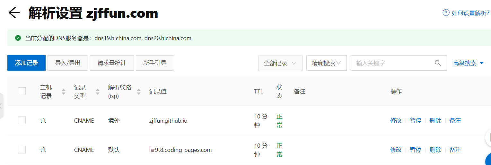

# 使用 nslookup 查看结果

在线工具:

[What Is NsLookup? Use Our Online Tool To Query DNS Records - Network Tools](https://network-tools.com/nslookup/)

| Name              | TTL Until Refresh | Class | Type  | Data              |
| ----------------- | ----------------- | ----- | ----- | ----------------- |
| tft.zjffun.com.   | 355               | IN    | CNAME | zjffun.github.io. |
| zjffun.github.io. | 3355              | IN    | HINFO | "RFC8482" ""      |

bash:

```bash
$ nslookup tft.zjffun.com 8.8.8.8
Server:         8.8.8.8
Address:        8.8.8.8#53

Non-authoritative answer:
tft.zjffun.com  canonical name = lsr9t8.coding-pages.com.
Name:   lsr9t8.coding-pages.com
Address: 150.109.34.254

$ nslookup tft.zjffun.com 1.1.1.1
Server:         1.1.1.1
Address:        1.1.1.1#53

Non-authoritative answer:
tft.zjffun.com  canonical name = zjffun.github.io.
Name:   zjffun.github.io
Address: 185.199.108.153
Name:   zjffun.github.io
Address: 185.199.109.153
Name:   zjffun.github.io
Address: 185.199.110.153
Name:   zjffun.github.io
Address: 185.199.111.153

$ nslookup tft.zjffun.com dns19.hichina.com
Server:         dns19.hichina.com
Address:        2400:3200:2000:38::1#53

tft.zjffun.com  canonical name = lsr9t8.coding-pages.com.
** server can't find lsr9t8.coding-pages.com: NXDOMAIN

$ nslookup tft.zjffun.com dns20.hichina.com
Server:         dns20.hichina.com
Address:        2400:3200:2000:39::1#53

tft.zjffun.com  canonical name = zjffun.github.io.
** server can't find zjffun.github.io: NXDOMAIN
```
