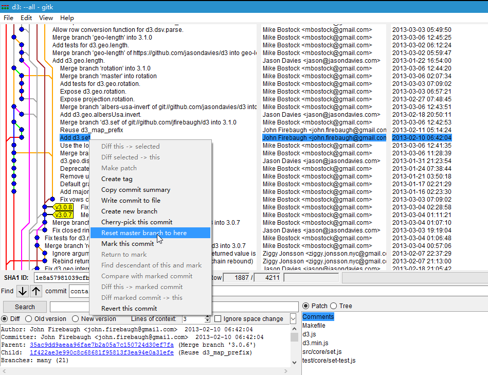
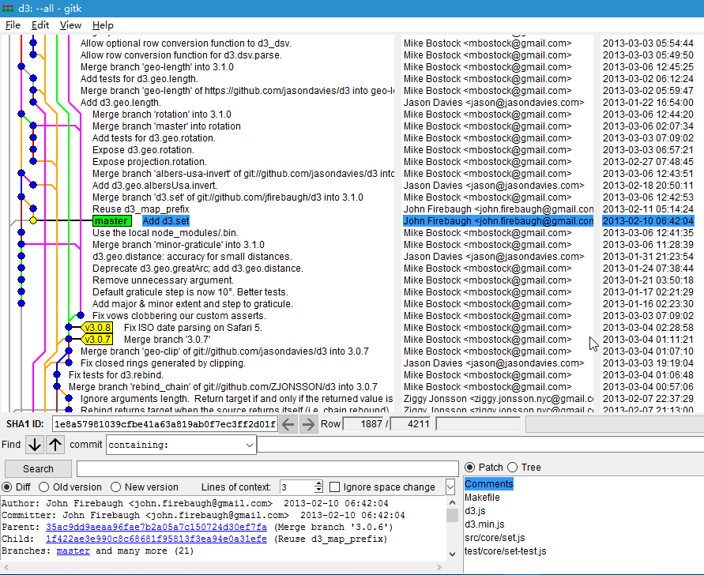

# 从最初提交开始学习每次提交的代码

> <https://stackoverflow.com/questions/5630110/how-to-read-source-code-using-git>

很久以前就觉得研究开源项目用命令行后退前进版本很累，今天又查了半天版本前进的好方法结果没有找到（毕竟 Git 的分支是个 DAG(有向无环图)），然后考虑使用一下 Git GUI 发现确实很好用。

## 打开 Git GUI 查看全部提交

在仓库右键， 点击《Git GUI Here》，然后点击菜单栏的《Repository》，选择《Visualize All Branch History》

## Reset 指定版本

## 查看 HEAD 附近的提交和分支

