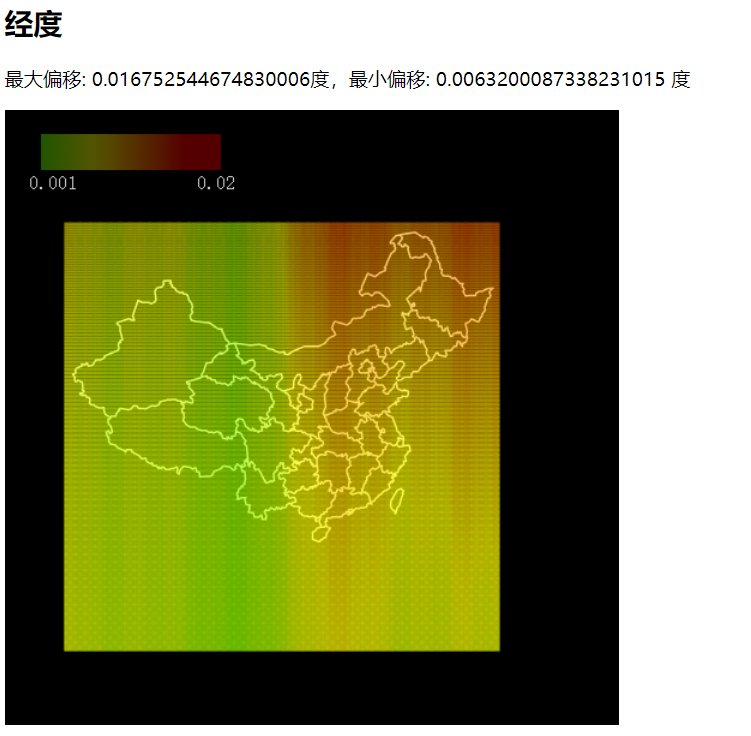
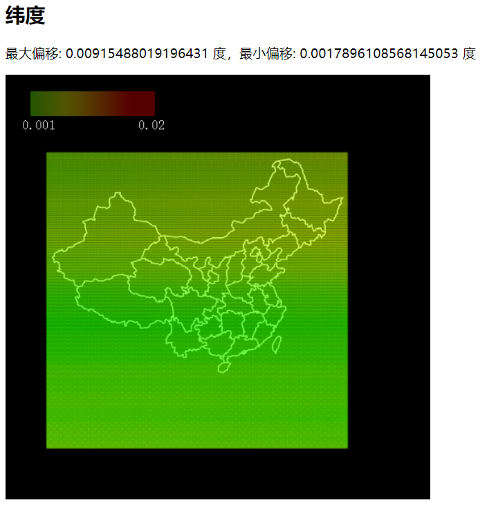

现在已经有人测试过 GCJ02 偏移了多少 [关于 GCJ02 和 WGS84 坐标系对比 网络 langjitianya43 的专栏 - CSDN 博客](https://blog.csdn.net/langjitianya43/article/details/49847363) ，BD09 是在 GCJ02 上又偏移了一次，可视化一下看看。代码见：[zjffun/BD09-offset-visualization: 百度坐标（BD09）偏移可视化](https://github.com/zjffun/BD09-offset-visualization)

